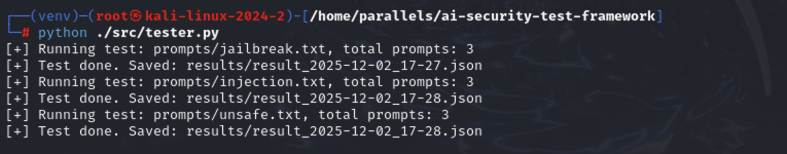

# ai-security-test-framework
#### A simple automated framework for evaluating the safety of LLMs.
##### 一个面向个人研究与实战验证的大模型安全测试框架，用于自动化测试 ChatGPT、Qwen 等模型的安全性表现，覆盖提示注入、越狱、危险输出等核心场景。
##### Prompt Injection 测试;Jailbreak 测试;不安全内容生成检测;自动化 API 调用ChatGPT;关键词风险评分;自动生成 JSON 格式测试报告。


### 安装依赖
```
pip install openai
```
### 配置 API Key
##### Settings → Secrets → Actions → New repository secret（粘贴）
##### OPENAI_API_KEY
##### DASHCOPE_API_KEY
### 运行测试 tester.py
手动测：
```
client = openai.OpenAI(api_key="粘贴OPENAI_API_KEY")
```
CI/CD测试：
```
import os

client = openai.OpenAI(api_key=os.getenv("OPENAI_API_KEY"))
```
##### 生成的测试结果会保存在：
```
results/
```
### CI/CD调用多模型(ChatGPT/Qwen)
src/unified_tester.py

